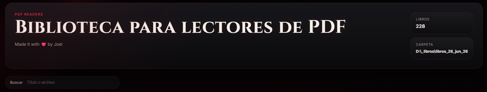

# Biblioteca Para Lectores de PDF



Biblioteca Para Lectores de PDF es un proyecto personal pensado para convertir una carpeta llena de archivos PDF en una experiencia visual mas agradable, inspirada en una biblioteca moderna. La aplicacion escanea tus libros, intenta detectar una portada real en la primera pagina y, cuando no existe, genera una miniatura de esa pagina para mantener una estanteria consistente y elegante.

La interfaz tiene una estetica oscura, gotica y moderna, con animaciones suaves, vista de biblioteca y un lector integrado en el navegador para abrir cada libro sin salir de la app.

## Que hace

- Escanea una carpeta de PDFs automaticamente.
- Muestra una cuadricula de libros con portadas o miniaturas generadas.
- Abre cada archivo en un lector web integrado.
- Incluye busqueda rapida por titulo o nombre de archivo.
- Permite agregar nuevos libros desde la interfaz web.
- Usa una interfaz visual personalizada con estilo dark/gothic.

## Con que fue creado

Este proyecto fue construido con:

- `Python 3.11`
- `Flask` para el servidor web local
- `PyMuPDF` para leer PDFs y renderizar portadas o primeras paginas
- `Pillow` para procesar y guardar miniaturas
- `HTML`, `CSS` y `JavaScript` para la interfaz

## Clonar y ejecutar

```bash
git clone https://github.com/tu-usuario/tu-repo.git
cd tu-repo
python -m venv .venv
```

Activa el entorno virtual:

```powershell
.venv\Scripts\Activate.ps1
```

Instala dependencias y ejecuta:

```powershell
python -m pip install -r requirements.txt
python index.py
```

Luego abre:

```text
http://127.0.0.1:5000
```

## Como agregar tus PDFs

Por defecto la app usa la carpeta `pdfs_books/` dentro del proyecto.

Debes crear esa carpeta y meter ahi tus libros `.pdf`. Si no existe, la aplicacion tambien puede crearla automaticamente cuando subes un libro desde el boton de la portada.

Tambien puedes agregar libros desde la interfaz: usa el boton `Seleccionar PDF`, elige un archivo y la aplicacion lo copiara dentro de `pdfs_books/`.

Si prefieres usar otra ubicacion, define esta variable de entorno:

```powershell
$env:PDF_LIBRARY_ROOT="D:\ruta\a\tus\pdfs"
python index.py
```

## Estructura del proyecto

```text
.
|- index.py
|- requirements.txt
|- imgs/
|  |- portadita.png
|- pdfs_books/
|- static/
|- templates/
`- README.md
```

## Notas

- La carpeta `pdfs_books/` puede mantenerse vacia en GitHub; cada persona puede llenarla con sus propios libros.
- Las miniaturas se generan en cache localmente cuando abres la biblioteca.
- Este proyecto nacio como una biblioteca personal, pero quedo preparado para que cualquier persona pueda clonarlo y usarlo con su propia coleccion.
